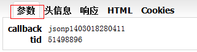

## AJAX及跨域

### AJAX理论
* **传统请求方式：**用户单击提交按钮提交表单，整个表单提交到服务器，服务器执行相应脚本（如果有），脚本执行完返回全新页面，返回时浏览器重新刷新绘制，用户需要等待,整个过程围绕表单进行。
* **请求类型：**`get` 和 `post`
```html
<form method="get" action="http://a.com/">
<input type="text" value="hello" name="username" id="username" />
</form>
www.a.com?username=hello
```
* **AJAX请求：**用户手动整合需要发送的数据发送到js代码（而不是直接发送到服务器），js处理数据并发送请求，服务器返回信息，触发在js中定义的处理事件，对返回数据进行处理。这些js代码主要使用 **XMLHttpRequest** 对象，整个过程是异步的，页面无需刷新，用户继续其它操作，js在幕后与服务器通信而不受用户干预

**大概流程**

1.  创建XMLHttpRequest对象
2.  获取数据
3.  建立连接
4.  定义回调函数
5.  发送请求

简单案例
```js
//1.创建XMlHttpRequest 对象
var xhr = null;
if (window.ActiveXObject) {
	xhr = new ActiveXObject("Microsoft.XMLHTTP");
} else if (window.XMLHttpRequest) {
	xhr = new XMLHttpRequest();
}

//2.获取数据 创始请求
var url = "ajax_check_pname.php?pname=" + pname.value + "&r=" + Math.random();
xhr.open("get", url);

//3.捕获请求状态和请求结果 定义回调函数
xhr.onreadystatechange = function() {
  if (4 == xhr.readyState && 200 == xhr.status) {
    if (parseInt(xhr.responseText)) {
      //code
    }
  }
}

//4.发送请求
xhr.send(null);
```

**HTTP就绪状态**
AJAX的每一次请求都伴随着HTTP就绪状态的改变，每次改变都会调用onreadystatechange定义的回调函数，HTTP就绪状态有如下几种

* 0：请求没建立，（调用open()之前）
* 1：请求建立但没发出，（调用send()之前）
* 2：请求发出正在处理中，响应中可以得到内容头部
* 3：请求已处理，响应中可以得到部分数据，但服务器没完成响应
* 4：响应完成，可以使用响应数据

> 注意：不同浏览器就绪状态不同，有些直接跳过0跟1，从2开始，有些有多次状态1，有些则从0到4

**HTTP状态码**
如果服务器响应了请求并完成了处理，但报告了一个错误，这样就算HTTP就绪状态为4也得不到预期的数据，因为除了判断HTTP就绪状态外还需要判断HTTP状态码，HTTP状态码可以表示请求中发生的任何问题，但状态为200时表示一切正常。

**传输数据**

* 以XML格式向服务器发送请求或以XML格式从服务器接收数据，数据量会比文本大，构建XML有一定复杂性
* json格式可表示除简单健值对之外的更复杂的数据结构，且数据是动态的，可输出或修改。最大的方便是可以利用 JavaScript 对象和字符串值来快速转换，而且，不管使用 GET 还是 POST，由于 JSON 只是文本。不需要特殊格式的转码而且每个服务器端脚本都能处理文本数据，所以可以轻松利用 JSON 并将其应用到服务器

### JSON格式
JSON（JavaScript Object Notation） 是一种轻量级的数据交换格式,完全独立于语言，由两种基础结构组成

1. “键/值”对的集合：用大括号包围，键与值之间用冒号隔开，“键/值”对之间用逗号隔开。
2. 值的有序列表：用中括号包围，用逗分分隔

```js
{"name1":value1}
{"name1":value1,"name2":value2}
{"name1":[value1,value2]}
[value1,value2] //wrong
```

**javascript 中使用JSON**
下载扩展API包：https://github.com/douglascrockford/JSON-js   
解压后得到文件：json2.js、json.js、json_parse_state.js、json_parse.js、cycle.js

**json2.js：**定义了一个全局的对象JSON，带有两个方法 stringify 和 parse 来实现转换或解析 json 格式。  
**json.js：**跟 json2.js 基本一样，也是定义了JSON对象，同时还给 Object 对象扩展了两个方法 toJSONString 和 parseJSON，方便变量随时转换或解析json格式。 

使用案例
```js
var jsonobj = new Object();
jsonobj.username = "uname";
jsonobj.password = "pwd";
var jsonstr = JSON.stringify(jsonobj);
alert(jsonstr);
```
结果：`{"username":"uname","password":"pwd"}`  
如果不转换会直接输出`[object Object]`

**使用eval()函数**
```js
var obj=eval("("+data+")");//转换为json对象 
```

### jQuery中的AJAX方法
jQuery对AJAX操作进行了封装，$.ajax() 属于最底层的方法 ，第二层是 load()，$.get()，$.post() 方法 ，第三层则是 $.getScript() 和 $.getJSON() 方法

**load()方法**  
选择目标容器DOM调用该方法，可能载入远程HTML内容追加到目标容器中，可以添加发送数据和定义回调函数。通常用于从服务器获取静态内容
```js
$("#restext").load("test.html");//把text.html的内容添加到id=restext的div中
```
当不指定参数时默认为 GET 发送，如果指定参数则自动转换为 POST 发送
```js
$("#restext").load("test.html",{name:"apple",key:"1"});
```


**$.get()方法**  
```js
$("#send").click(function(){
     $.get("getdata.php",{username:$("#uname").val()},function(data,textStatus){
          $("#restext").html(data);
     },"html");
});
```
> 注意：发送的数据以对象的形式（也可以是字符串，但要手动对字符进行编码）作为第二个参数传入，而不是手动追加在url后面，该方法会自动将数据附加到url

**$.getJSON()方法**  
动态加载JSON文件，并在回调函数中对返回数据进行处理。使用该方法还可以加载其它服务器的JSON数据，实现跨域请求
```js
$("#send").click(function(){
     $.getJSON('text.json',function(data){
          $.each(data,function(index,item){
               $(".txg").html(item['content']);
          });
     })
})
```

**关于调试**

  


### 跨域
**什么是跨域**
**同源策略：**一个域的脚本不能访问和操作另外一个域的绝大部分对象和方法  
**沙箱安全模型：**只能对同一个域发送异步请求而无法重定向到其它服务器  
> 注意：这里的同域不单单指相同的域名，同一域名不同端口，不同协议，相同主域而子域不同这些情况也在跨域范畴里

### JSONP跨域
**原理：**Web页面上调用js文件时则不受是否跨域的影响，而且，凡是拥有 src 这个属性的标签都拥有跨域的能力，比如`<script>`、``、`<iframe>`.利用这点可以在远程服务器上设法把数据装进js格式的文件里，供客户端调用和进一步处理。具体实现方法是web客户端通过与调用脚本一模一样的方式，来调用跨域服务器上动态生成的js格式文件。这种获取远程数据的方式看起来非常像 AJAX，但其本质并不一样。这种获取远程数据的方式逐渐形成了一种非正式传输协议，人们把它称作 JSONP，该协议的一个要点就是允许用户传递一个 callback 参数给服务端，然后服务端返回数据时会将这个 callback 参数作为函数名来包裹住 JSON 数据，这样客户端就可以随意定制自己的函数来自动处理返回数据了。

所以，ajax 和 jsonp 本质上是不同的东西。ajax 的核心是通过 XmlHttpRequest 异步获取数据并更新处理，而 jsonp 的核心则是动态添加`<script>`标签来调用服务器提供的js脚本，ajax 与 jsonp 的区别不在于是否跨域，ajax 通过服务端代理一样可以实现跨域，jsonp本身也不排斥同域的数据获取。**跨域不一定用到 ajax，而 ajax 一般使用 jsonp 来实现跨域**

> 注意：使用JSONP来跨域要求请求类型只能是get，如果是post类型的跨域，可以用iframe跨域等其它方式

**实现方式一**
```html
<script type="text/javascript">
var custom_callback = function(data){
     alert(data.txt);
};
</script>
<script type="text/javascript" src="http://xxx.com?var=1&callback=custom_callback"></script>
```
服务器端
```
custom_callback("hello")
```
**实现方式二**
```js
var custom_callback = function(data){
     alert(data.txt);
};
var JSONP=document.createElement("script");
JSONP.type="text/javascript";
JSONP.src="http://xxx.com?var=1&callback=custom_callback";
document.getElementsByTagName('head')[0].appendChild(script);
```
**jQuery中的实现**
```js
$.getJSON("http://xxx.com?var=1&callback=?", 
function(data){
     alert(data.txt);
});
```
或
```js
$.get('http://xxx.com?callback=?', {var: 1}, function (data){alert(data.txt);}, 'jsonp');  
```
或
```js
$.ajax({
     url:"http://xxx.com?var=1",
     dataType:'jsonp',
     data:'',
     jsonp:'callback', 
     success:function(data) {
          alert(data.txt);
     },
     timeout:3000
});
```

### window.name 跨域
原理：window窗口（包括iframe）在加载新页面时，其 name 属性的值是保持不变的，该值可以保存2M大小的数据（IE 或 firefox 是32M）

步骤一：跨域页面（服务器端）组织数据并保存到 name 属性  
```js
window.name = 'data';
```
```html
<html>
  <body>
    <script>
      window.name = 'data';
    </script>
  </body>
</html>
```
步骤二：在当前页面创建一个 iframe，将其 src 指向跨域页面  
步骤三：改变 iframe 的 src ，使其和当前页面同域，可以预先准备一个空文件 blank.html 或直接指向 favicon.ico  
步骤四：通过监听 iframe 的 load 事件来获取数据
```js
var state = 0,
	iframe = document.createElement('iframe'),
  document.body.appendChild(iframe);
  loadfn = function() {
    if (state === 1) {
      var data = iframe.contentWindow.name;
      alert(data);
    } else if (state === 0) {
      state = 1;
      iframe.contentWindow.location = "http://a.com/blank.html"; // 设置的代理文件
    }
  };
if (iframe.attachEvent) {
  iframe.attachEvent('onload', loadfn);
} else {
  iframe.onload = loadfn;
}
iframe.src = 'http://b.com/data.html';
```
步骤五：销毁 iframe
```js
iframe.contentWindow.document.write('');
iframe.contentWindow.close();
document.body.removeChild(iframe);
```
完整代码
```js
(function() {
    windowname = {
        cfg: {
            proxy: 'blank.html'
        }
    };
    windowname.send = function(url, callback) {
        if (!url || typeof url !== 'string') {
            return;
        }
        var frame = this.document.createElement('iframe'),
            state = 0,
            self = this;
        this.document.body.appendChild(frame);
        frame.style.display = 'none';
        var clearframe = function() {
            frame.contentWindow.document.write('');
            frame.contentWindow.close();
            self.document.body.removeChild(frame);
        };
        var getdata = function() {
            var data = frame.contentWindow.name;
            clearframe();
            if (callback && typeof callback === 'function') {
                callback(data);
            }
        };
        var loadfn = function(){
            if (state === 1) {
                getdata();
            } else if (state === 0) {
                state = 1;
                frame.contentWindow.location = self.cfg.proxy;
            }
        }
        if (frame.attachEvent) {
            frame.attachEvent('onload', loadfn);
        } else {
            frame.onload = loadfn;
        }
        frame.src = url;
    };
})();
```
> **插件：** jQuery.windowName.plugin.js

### domain 跨域
解决主域相同而二级域名不同的两个页面的通讯，这里以http://www.a.com/a.html和http://script.a.com/b.html为例

步骤一：设置同一主域，两个页面分别加上 
```js
document.domain = ‘a.com’
```
步骤二：a.html 创建 iframe，指向 b.html
```js
var ifr = document.createElement('iframe');
ifr.src = 'http://script.a.com/b.html';
ifr.style.display = 'none';
document.body.appendChild(ifr);
```
步骤三：通过 iframe 的 contentDocument 获取 b.html 的内容
```js
ifr.onload = function(){
    var doc = ifr.contentDocument || ifr.contentWindow.document;
    alert(doc.getElementsByTagName("h1")[0].childNodes[0].nodeValue);
};
```

> 注意：某一页面的 domain 默认等于 window.location.hostname。主域名是不带 www 的域名，如 www.a.com 是二级域名，domain 只能设置为自已的主域名，比如不可以在 b.a.com 中将 domain 设置为 c.a.com，也不可以设置为 c.com